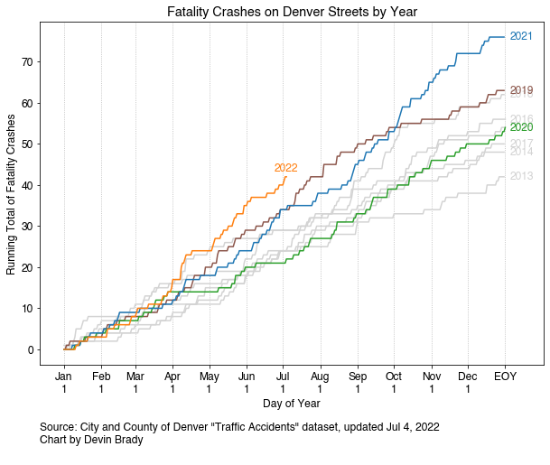
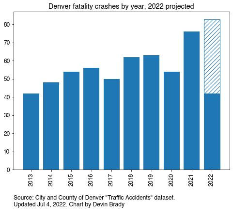

# denver-street-data
Analyzing data and creating visualizations about streets in Denver, Colorado, USA. 

## Running Total of Fatality Crashes by Year

This chart shows the number of fatality crashes that have happened as a running total within each year. 

It shows that fatality crashes stopped at the onset of the pandemic in 2020 (green line). But in 2021 and 2022, fatality crashes started happening much more frequently. Denver is now on pace to have more fatality crashes on its streets than ever before, going back to 2013. 

## Fatality Crashes by Year

2022 is projected to have more fatality crashes in Denver than any year on record. By July 4, 2022, there have been 42 fatality crashes, matching the total for all of 2013. 