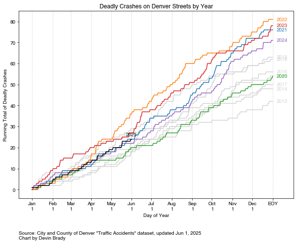

# denver-street-data
Analyzing data and creating visualizations about streets in Denver, Colorado, USA. 

## Running Total of Deadly Crashes by Year

This chart shows the number of deadly crashes that have happened as a running total within each year. 

It shows that deadly crashes stopped at the onset of the pandemic in 2020 (green line). But in 2021 and 2022, deadly crashes started happening much more frequently. Denver is now on pace to have more deadly crashes on its streets than ever before, going back to 2013. 

## Deadly Crashes by Year

2022 is projected to have more deadly crashes in Denver than any year on record. By July 4, 2022, there have been 42 deadly crashes, matching the total for all of 2013. 