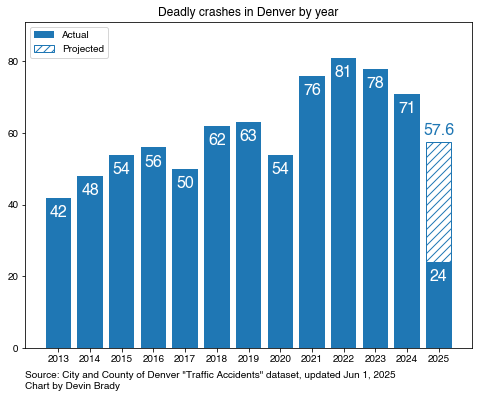

# denver-street-data
Analyzing data and creating visualizations about streets in Denver, Colorado, USA. 

## Running Total of Deadly Crashes by Year

This chart shows the number of deadly crashes that have happened as a running total within each year. 

It shows that deadly crashes stopped at the onset of the pandemic in 2020 (green line). But in 2021 and 2022, deadly crashes started happening much more frequently. 

## Deadly Crashes by Year

## Data Source

The data comes from the "Traffic Accidents" dataset maintained by the City of Denver: [https://denvergov.org/opendata/dataset/city-and-county-of-denver-traffic-accidents](https://denvergov.org/opendata/dataset/city-and-county-of-denver-traffic-accidents)

## Data Quirks

To be included in this dataset, the crash must have:

* Occurred in the city of Denver since Jan 1, 2013
* Involved at least one vehicle eligible for a license plate
    * Examples of a crashes not included is one where an RTD train hits a pedestrian, or a crash where a person on a bike hits another person on a bike

## SQL Query Examples

See the file [sql/query_examples.sql](sql/query_examples.sql) for some example queries. 

